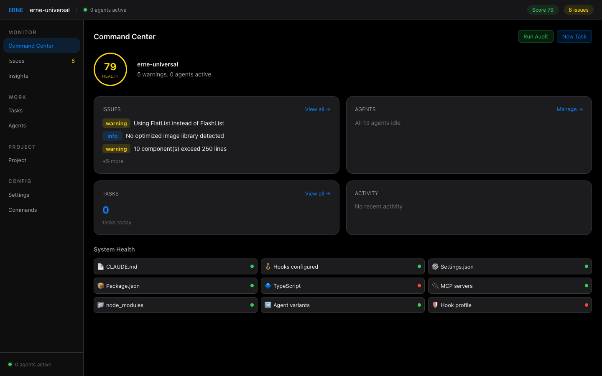
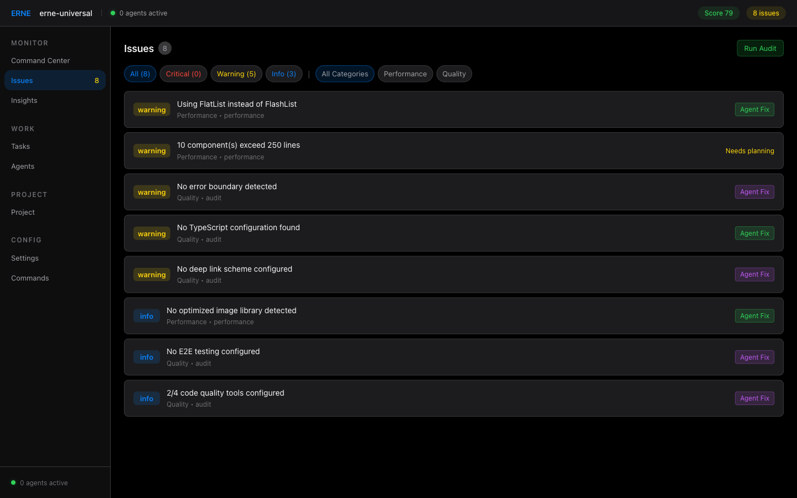
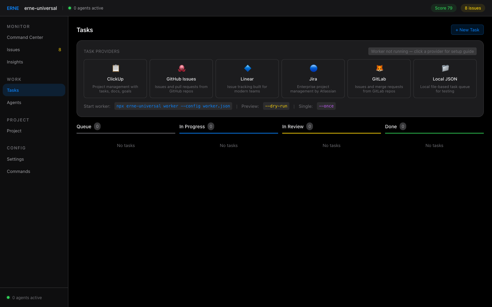
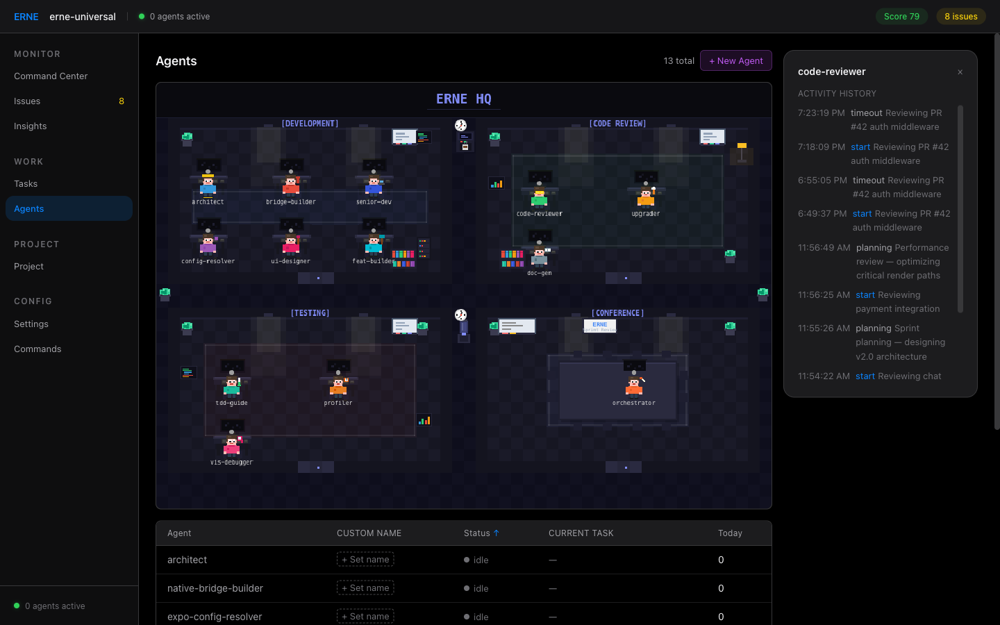
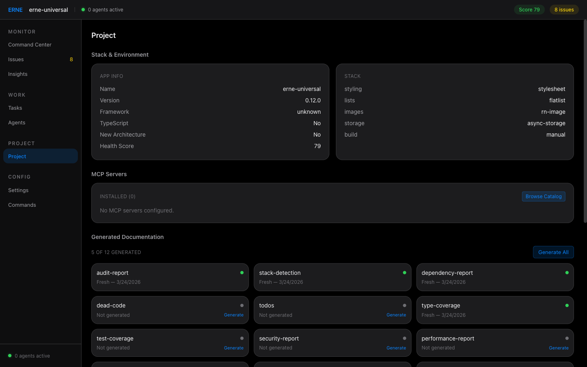
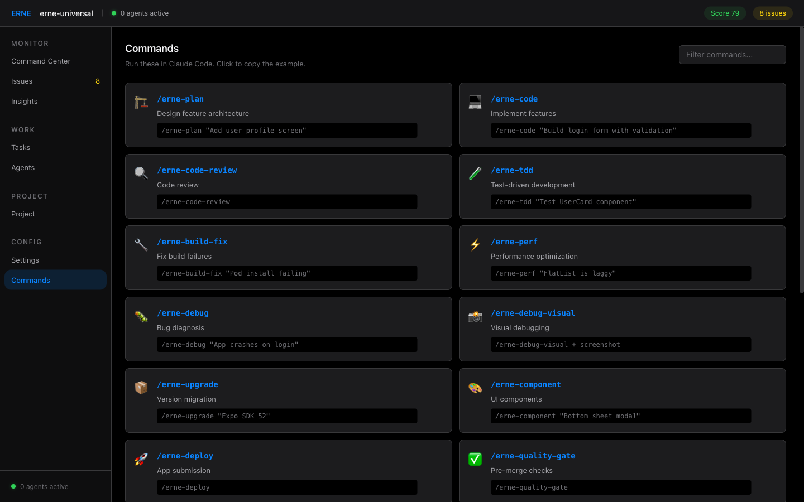

# 🏗️ ERNE — Everything React Native & Expo

> **AI agent harness with 13 specialized agents, autonomous worker, video debugging, adaptive fix, and 29 auto-updating knowledge rules.** Adaptive stack detection, multi-agent orchestration, and a pixel-art dashboard. Every config is generated to match _your_ exact project setup.

[](https://www.npmjs.com/package/erne-universal)
[](https://github.com/JubaKitiashvili/everything-react-native-expo)
[](https://opensource.org/licenses/MIT)
[](https://makeapullrequest.com)

<p align="center">
  <video src="https://github.com/user-attachments/assets/08e578e9-1bbd-49af-bac4-0b18365137af" autoplay loop muted playsinline width="800"></video>
</p>

---

## ⚡ Quick Start

> **Prerequisite:** [Claude Code](https://claude.ai/claude-code) is required for the full experience (13 agents, pipeline orchestration, dashboard, hooks). Other IDEs receive adaptive rules and configuration — see [IDE Support](#%EF%B8%8F-ide--editor-support).

```bash
npx erne-universal init
```

This will:

1. 🔍 **Deep-scan your project** — detects 15 stack dimensions (state management, navigation, styling, lists, images, forms, storage, testing, build system, component style, monorepo, New Architecture, and more)
2. 🎚️ Let you choose a hook profile (minimal / standard / strict)
3. 🔌 Select MCP integrations (simulator control, GitHub, etc.)
4. ⚙️ **Generate adaptive configuration** — selects from 24 variant templates matched to your exact stack (Zustand vs Redux, Expo Router vs React Navigation, NativeWind vs StyleSheet, etc.)

---

## 📦 What's Included

| Component            | Count | Description                                                                                  |
| -------------------- | ----- | -------------------------------------------------------------------------------------------- |
| 🤖 Agents            | 13    | Specialized AI agents incl. visual debugger, doc generator, smart routing                    |
| 🔀 Agent variants    | 9     | Stack-adaptive agent configurations (StyleSheet vs NativeWind, Zustand vs Redux, etc.)       |
| ⚡ Commands          | 23    | Slash commands for every React Native workflow (incl. /erne-debug-video)                     |
| 📏 Rule layers       | 5     | Conditional rules: common, expo, bare-rn, native-ios, native-android                         |
| 🎯 Rule variants     | 15    | Stack-specific rules selected by deep detection (state, navigation, styling, security, etc.) |
| 📚 Knowledge rules   | 29    | Expo SDK 55, RN 0.84, React 19.2, Reanimated, Skia, Gesture Handler, SVG, ExecuTorch, more   |
| 🛡️ Hook profiles     | 3     | Minimal, standard, strict — quality enforcement your way                                     |
| 📚 Skills            | 7     | Reusable knowledge modules loaded on-demand                                                  |
| 🎭 Contexts          | 3     | Behavior modes: dev, review, vibe                                                            |
| 🔌 MCP configs       | 10    | Pre-configured server integrations                                                           |
| 🎬 Video debugging   | 1     | Analyze screen recordings for temporal UI bugs                                               |
| 🔧 Adaptive Fix      | —     | Agent-based or direct fix from dashboard                                                     |
| 📋 Workflow examples | 4     | End-to-end multi-agent workflow guides                                                       |
| 🤝 Handoff templates | 4     | Structured agent-to-agent context passing                                                    |

---

## 🎮 Agent Dashboard

ERNE includes a real-time dashboard with 6 pages, pixel-art agent HQ, and adaptive fix integration.

```bash
erne dashboard              # Start on port 3333, open browser
erne dashboard --port 4444  # Custom port
erne dashboard --no-open    # Don't open browser
erne start                  # Init project + dashboard in background
```

### Command Center

<p align="center">
  
</p>

Health score, issues summary, agent status, system health checks.

### Issues — Agent Fix

<p align="center">
  
</p>

Severity filtering, Agent Fix buttons (auto-detects Claude Code), "Needs planning" for complex issues, real-time fix output.

### Tasks — Worker & Providers

<p align="center">
  
</p>

6 provider integrations (ClickUp, GitHub, Linear, Jira, GitLab, Local), Kanban board, interactive setup guides.

### Agents — Pixel Art HQ

<p align="center">
  
</p>

13 animated agents in 4 rooms, real-time status, custom naming, activity history.

### Project — Stack & Docs

<p align="center">
  
</p>

Stack detection, MCP servers, generated documentation (12 doc types), recommendations.

### Commands

<p align="center">
  
</p>

23 commands including /erne-debug-video, click to copy.

---

## 🎬 Video Debugging

Analyze screen recordings to find temporal UI bugs that screenshots cannot capture.

```bash
/erne-debug-video recording.mp4
```

Catches: animation glitches, race conditions, gesture issues, scroll jank, keyboard overlap, navigation transitions.

- Extracts key frames via ffmpeg scene detection (any format: mp4, mov, webm, avi, mkv, gif)
- Claude analyzes frames as a timeline with frame references
- No additional API keys needed — uses Claude you already have

---

## 📚 29 Knowledge Rules (Auto-Updating)

ERNE ships with 29 comprehensive rule files covering the entire React Native ecosystem:

| Category         | Rules | Coverage                                                                           |
| ---------------- | ----- | ---------------------------------------------------------------------------------- |
| Core             | 10    | Expo SDK 55, RN 0.84, React 19.2, navigation, patterns, styling, testing, security |
| Expo Packages    | 4     | 40+ packages: audio, video, camera, file-system, sqlite, notifications, location   |
| Software Mansion | 5     | Reanimated v4, Gesture Handler, Skia, SVG, Screens                                 |
| Callstack        | 5     | Native bottom tabs, RNTL, on-device AI, Reassure, Voltra                           |
| Cutting-edge     | 5     | ExecuTorch (on-device LLM), Audio API, Enriched (rich text), Freeze, Screens       |

Rules auto-update weekly via GitHub Action — checks npm for new SDK/RN versions, analyzes changelogs with Claude API, and opens a PR.

---

## 🎯 Multi-Agent Orchestration

ERNE supports coordinated multi-agent workflows through the pipeline orchestrator:

```bash
/orchestrate "build user profile screen"
```

**Pipeline phases:**

```
  🏗️ Plan          architect decomposes the task
       ↓
  ⚡ Implement     senior-developer + feature-builder (parallel)
       ↓
  🧪 Test          tdd-guide writes and runs tests
       ↓
  🔍 Review        code-reviewer validates with evidence
       ↓
  📊 Validate      performance-profiler checks performance
```

Features retry logic (max 3 attempts), escalation to user on persistent failures, and structured [handoff templates](docs/handoff-templates.md) for context passing between agents. See [Pipeline Documentation](docs/pipeline.md) for details.

---

## 🤖 Agents

Each agent has a distinct personality, quantified success metrics, and memory integration for cross-session learning.

| Agent                       | Emoji | Domain                                                 | Room        |
| --------------------------- | ----- | ------------------------------------------------------ | ----------- |
| **architect**               | 🏗️    | System design and project structure                    | Development |
| **senior-developer**        | 👨‍💻    | End-to-end feature implementation, screens, hooks, API | Development |
| **feature-builder**         | ⚡    | Focused implementation units, works in parallel        | Development |
| **native-bridge-builder**   | 🌉    | Turbo Modules and native platform APIs                 | Development |
| **expo-config-resolver**    | ⚙️    | Expo configuration and build issues                    | Development |
| **ui-designer**             | 🎨    | Accessible, performant UI components                   | Development |
| **code-reviewer**           | 🔍    | Code quality with evidence-based approval              | Code Review |
| **upgrade-assistant**       | 📦    | Version migration guidance                             | Code Review |
| **tdd-guide**               | 🚦    | Test-driven development workflow                       | Testing     |
| **performance-profiler**    | 🏎️    | FPS diagnostics and bundle optimization                | Testing     |
| **pipeline-orchestrator**   | 🎯    | Multi-agent workflow coordination                      | Conference  |
| **visual-debugger**         | 🔬    | Screenshot-based UI debugging                          | Development |
| **documentation-generator** | 📝    | Auto-generate project documentation                    | Development |

---

## 🧠 Context Optimization

ERNE includes a built-in context intelligence system (auto-enabled with dashboard) that compresses tool outputs by **97-100%**, indexes content with FTS5 search, and manages your context budget. See [BENCHMARK.md](BENCHMARK.md) for the full 21-scenario breakdown.

---

## 💰 Token Efficiency

ERNE minimizes token usage through two complementary systems: **architecture-level savings** (what gets loaded into context) and **runtime context optimization** (how tool outputs and session state are compressed).

### Architecture savings

| Mechanism                  | How it works                                                          | Savings |
| -------------------------- | --------------------------------------------------------------------- | ------- |
| **Profile-gated hooks**    | Minimal profile runs 4 hooks instead of 16                            | ~31%    |
| **Conditional rules**      | Only loads rules matching your project type (Expo, bare RN, native)   | ~26%    |
| **On-demand skills**       | Skills load only when their command is invoked, not always in context | ~12%    |
| **Subagent isolation**     | Fresh agent per task with only its own definition + relevant rules    | ~12%    |
| **Task-specific commands** | 23 focused prompts instead of one monolithic instruction set          | ~13%    |
| **Context-based behavior** | Modes change behavior dynamically without loading new rulesets        | ~3%     |

### Runtime context optimization (benchmark-verified)

| Mechanism              | How it works                                                             | Savings                |
| ---------------------- | ------------------------------------------------------------------------ | ---------------------- |
| **Content summarizer** | Auto-detects 14 content types, produces statistical summaries            | **97–100%** per output |
| **Index + Search**     | FTS5 BM25 retrieval returns only relevant chunks, code preserved exactly | **80%** per search     |
| **Smart truncation**   | 4-tier fallback: Structured → Pattern → Head/Tail → Hash                 | 85–100% per output     |
| **Session snapshots**  | Captures full session state in <2KB                                      | ~50% vs log replay     |
| **Budget enforcement** | Throttling at 80% prevents runaway token usage                           | Prevents overflow      |

**Result:** Architecture saves **60–67%** on what enters context. Runtime optimization achieves **97–100%** compression on tool outputs (verified across 21 benchmark scenarios with 537 KB of real data). In a full debugging session, **99% of tool output tokens are eliminated** — leaving 99.6% of your context window free for actual problem solving. See [BENCHMARK.md](BENCHMARK.md) for complete results.

---

## 🛡️ Hook Profiles

| Profile    | Hooks | Use Case                                                                     |
| ---------- | ----- | ---------------------------------------------------------------------------- |
| `minimal`  | 4     | ⚡ Fast iteration, vibe coding — maximum speed, minimum friction             |
| `standard` | 12    | ⚖️ Balanced quality + speed (recommended) — catches real issues              |
| `strict`   | 16    | 🔒 Production-grade enforcement — full security, accessibility, perf budgets |

Change profile: set `ERNE_PROFILE` env var, add `<!-- Hook Profile: standard -->` to CLAUDE.md, or use `/vibe` context.

---

## ⚡ Commands

| Category          | Commands                                                                                                               |
| ----------------- | ---------------------------------------------------------------------------------------------------------------------- |
| **Core**          | `/plan`, `/code-review`, `/tdd`, `/build-fix`, `/perf`, `/upgrade`, `/native-module`, `/navigate`, `/code`, `/feature` |
| **Extended**      | `/animate`, `/deploy`, `/component`, `/debug`, `/debug-visual`, `/debug-video`, `/quality-gate`                        |
| **Orchestration** | `/orchestrate`, `/worker`                                                                                              |
| **Learning**      | `/learn`, `/retrospective`, `/setup-device`                                                                            |

---

## 🖥️ IDE & Editor Support

ERNE generates adaptive config files for multiple IDEs, but the **full agent experience requires Claude Code**:

| Feature                         | Claude Code | Cursor / Windsurf / Copilot / Codex |
| ------------------------------- | :---------: | :---------------------------------: |
| Adaptive rules & config         |     ✅      |                 ✅                  |
| Stack detection (15 dimensions) |     ✅      |                 ✅                  |
| 23 slash commands               |     ✅      |                 ❌                  |
| 13 specialized agents           |     ✅      |                 ❌                  |
| Pipeline orchestration          |     ✅      |                 ❌                  |
| Hook profiles                   |     ✅      |                 ❌                  |
| Agent dashboard                 |     ✅      |                 ❌                  |
| Cross-session memory            |     ✅      |                 ❌                  |

**Generated config files:**

| File                              | IDE / Tool                              |
| --------------------------------- | --------------------------------------- |
| `CLAUDE.md`                       | Claude Code (full experience)           |
| `AGENTS.md`                       | Codex, Windsurf, Cursor, GitHub Copilot |
| `GEMINI.md`                       | Gemini CLI                              |
| `.cursorrules`                    | Cursor                                  |
| `.windsurfrules`                  | Windsurf                                |
| `.github/copilot-instructions.md` | GitHub Copilot                          |

---

## 🏗️ Architecture

```
Claude Code Hooks ──▶ run-with-flags.js ──▶ Profile gate ──▶ Hook scripts
                                                │
                                     ┌──────────┴──────────┐
                                     │   Only hooks for    │
                                     │   active profile    │
                                     │   are executed      │
                                     └─────────────────────┘

erne dashboard ──▶ HTTP + WS Server ──▶ Browser Canvas
                        ▲
Claude Code PreToolUse ─┤  (Agent pattern)
Claude Code PostToolUse ┘
```

**Key design principles:**

- 🪶 **Zero runtime dependencies** for the harness itself (ws package only for dashboard)
- 🎯 **Conditional loading** — rules, skills, and hooks load based on project type and profile
- 🧹 **Fresh subagent per task** — no context pollution between agent invocations
- 🔇 **Silent failure** — hooks never block Claude Code if something goes wrong

---

## 🤝 Contributing

We welcome contributions from everyone — from typo fixes to new agents and skills.

| I want to...           | Start here                                                                                                                |
| ---------------------- | ------------------------------------------------------------------------------------------------------------------------- |
| 🐛 Report a bug        | [Bug Report](https://github.com/JubaKitiashvili/everything-react-native-expo/issues/new?template=bug_report.md)           |
| 💡 Request a feature   | [Feature Request](https://github.com/JubaKitiashvili/everything-react-native-expo/issues/new?template=feature_request.md) |
| 📚 Propose a new skill | [Skill Proposal](https://github.com/JubaKitiashvili/everything-react-native-expo/issues/new?template=new_skill.md)        |
| 🔀 Submit a PR         | [Contributing Guide](CONTRIBUTING.md)                                                                                     |

```bash
git checkout -b feat/your-feature
npm run validate && npm test   # Must pass before PR
```

---

## 🤝 Partnerships

Skills, agents, and MCP configs are open source — anyone can add them via PR. Partnerships are for deeper collaboration:

| Partnership Type     | What It Means                                                                                        |
| -------------------- | ---------------------------------------------------------------------------------------------------- |
| **Co-Maintenance**   | You keep your library's ERNE skill up to date as your API evolves                                    |
| **Early Access**     | We update ERNE before your breaking changes ship, so users never hit stale guidance                  |
| **Joint Promotion**  | Your docs recommend ERNE for AI-assisted development, we feature you on [erne.dev](https://erne.dev) |
| **Domain Expertise** | Co-develop specialized agents that require deep knowledge of your platform                           |

If you maintain a React Native library, Expo tool, or developer service — [let's talk](https://github.com/JubaKitiashvili/everything-react-native-expo/issues/new?template=partnership.md).

---

## 📦 Available On

- [npm](https://www.npmjs.com/package/erne-universal) — `npx erne-universal init`
- [SkillsMP](https://skillsmp.com) — Auto-indexed from GitHub
- [BuildWithClaude](https://buildwithclaude.com) — Plugin directory
- [VoltAgent/awesome-agent-skills](https://github.com/VoltAgent/awesome-agent-skills) — Curated skills list

---

## 📖 Documentation

| Doc                                              | Description                          |
| ------------------------------------------------ | ------------------------------------ |
| [Getting Started](docs/getting-started.md)       | Installation and first run           |
| [Agents Guide](docs/agents.md)                   | All 13 agents with domains and usage |
| [Commands Reference](docs/commands.md)           | All 23 slash commands                |
| [Hooks & Profiles](docs/hooks-profiles.md)       | Hook system and 3 profiles           |
| [Creating Skills](docs/creating-skills.md)       | Author your own skills               |
| [Pipeline & Orchestration](docs/pipeline.md)     | Multi-agent workflow coordination    |
| [Memory Integration](docs/memory-integration.md) | Cross-session learning with MCP      |
| [Handoff Templates](docs/handoff-templates.md)   | Structured agent-to-agent context    |
| [Contributing](CONTRIBUTING.md)                  | How to contribute                    |

---

## 📜 License

MIT License — use freely, commercially or personally.

---

<div align="center">

**🏗️ ERNE — Your React Native AI Dream Team 🏗️**

[⭐ Star this repo](https://github.com/JubaKitiashvili/everything-react-native-expo) · [🍴 Fork it](https://github.com/JubaKitiashvili/everything-react-native-expo/fork) · [🐛 Report an issue](https://github.com/JubaKitiashvili/everything-react-native-expo/issues) · [🌐 erne.dev](https://erne.dev)

Made with ❤️ for the React Native community

</div>
