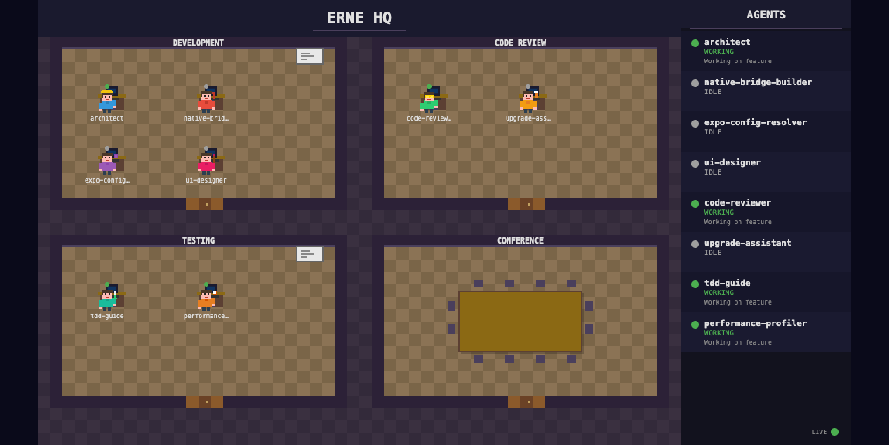

# everything-react-native-expo (ERNE)

Complete AI coding agent harness for React Native and Expo development.

<p align="center">
  
</p>

## Quick Start

```bash
npx erne-universal init
```

This will:
1. Detect your project type (Expo managed, bare RN, or monorepo)
2. Let you choose a hook profile (minimal / standard / strict)
3. Select MCP integrations (simulator control, GitHub, etc.)
4. Generate your `.claude/` configuration

## What's Included

| Component | Count | Description |
|-----------|-------|-------------|
| Agents | 8 | Specialized AI agents for architecture, review, testing, UI, native, and more |
| Commands | 16 | Slash commands for every React Native workflow |
| Rule layers | 5 | Conditional rules: common, expo, bare-rn, native-ios, native-android |
| Hook profiles | 3 | Minimal, standard, strict — quality enforcement your way |
| Skills | 8 | Reusable knowledge modules loaded on-demand |
| Contexts | 3 | Behavior modes: dev, review, vibe |
| MCP configs | 10 | Pre-configured server integrations |

## Token Efficiency

ERNE's architecture is designed to minimize token usage through six layered mechanisms:

| Mechanism | How it works | Savings |
|-----------|-------------|---------|
| **Profile-gated hooks** | Minimal profile runs 3 hooks instead of 17 | ~31% |
| **Conditional rules** | Only loads rules matching your project type (Expo, bare RN, native) | ~26% |
| **On-demand skills** | Skills load only when their command is invoked, not always in context | ~12% |
| **Subagent isolation** | Fresh agent per task with only its own definition + relevant rules | ~12% |
| **Task-specific commands** | 16 focused prompts instead of one monolithic instruction set | ~13% |
| **Context-based behavior** | Modes change behavior dynamically without loading new rulesets | ~3% |

**Result:** Typical workflows use **60–67% fewer tokens** compared to a naive all-in-context approach. Vibe mode (minimal profile) reaches 67% savings, standard development 64%, and even strict mode saves 57%.

## Agent Dashboard

ERNE includes a real-time pixel-art dashboard that visualizes all 8 agents working in an animated office environment.

```bash
erne dashboard              # Start on port 3333, open browser
erne dashboard --port 4444  # Custom port
erne dashboard --no-open    # Don't open browser
erne start                  # Init project + dashboard in background
```

**Features:**
- 4 office rooms (Development, Code Review, Testing, Conference)
- 8 unique procedural pixel-art agent sprites with animations
- Real-time status updates via WebSocket (connected to Claude Code hooks)
- Sidebar with agent status, task descriptions, and connection indicator
- Auto-reconnect with exponential backoff

The dashboard hooks into Claude Code's `PreToolUse` and `PostToolUse` events (pattern: `Agent`) to track which agents are actively working and what they're doing.

## IDE & Editor Support

ERNE works with every major AI coding assistant out of the box:

| File | IDE / Tool |
|------|-----------|
| `CLAUDE.md` | Claude Code |
| `AGENTS.md` | Codex, Windsurf, Cursor, GitHub Copilot |
| `GEMINI.md` | Google Antigravity |
| `.cursorrules` | Cursor |
| `.windsurfrules` | Windsurf |
| `.github/copilot-instructions.md` | GitHub Copilot |

All config files share the same React Native & Expo conventions: TypeScript strict mode, Expo Router, Zustand + TanStack Query, testing with Jest/RNTL/Detox, and security best practices.

## Agents

| Agent | Domain | Room |
|-------|--------|------|
| **architect** | System design and project structure | Development |
| **native-bridge-builder** | Turbo Modules and native platform APIs | Development |
| **expo-config-resolver** | Expo configuration and build issues | Development |
| **ui-designer** | Accessible, performant UI components | Development |
| **code-reviewer** | Code quality and best practices | Code Review |
| **upgrade-assistant** | Version migration guidance | Code Review |
| **tdd-guide** | Test-driven development workflow | Testing |
| **performance-profiler** | FPS diagnostics and bundle optimization | Testing |

## Hook Profiles

| Profile | Hooks | Use Case |
|---------|-------|----------|
| minimal | 3 | Fast iteration, vibe coding — maximum speed, minimum friction |
| standard | 11 | Balanced quality + speed (recommended) — catches real issues |
| strict | 17 | Production-grade enforcement — full security, accessibility, perf budgets |

Change profile: set `ERNE_PROFILE` env var, add `<!-- Hook Profile: standard -->` to CLAUDE.md, or use `/vibe` context.

## Commands

**Core:** `/plan`, `/code-review`, `/tdd`, `/build-fix`, `/perf`, `/upgrade`, `/native-module`, `/navigate`

**Extended:** `/animate`, `/deploy`, `/component`, `/debug`, `/quality-gate`

**Learning:** `/learn`, `/retrospective`, `/setup-device`

## Architecture

```
Claude Code Hooks ──▶ run-with-flags.js ──▶ Profile gate ──▶ Hook scripts
                                                │
                                     ┌──────────┴──────────┐
                                     │   Only hooks for    │
                                     │   active profile    │
                                     │   are executed      │
                                     └─────────────────────┘

erne dashboard ──▶ HTTP + WS Server ──▶ Browser Canvas
                        ▲
Claude Code PreToolUse ─┤  (Agent pattern)
Claude Code PostToolUse ┘
```

**Key design principles:**
- **Zero runtime dependencies** for the harness itself (ws package only for dashboard)
- **Conditional loading** — rules, skills, and hooks load based on project type and profile
- **Fresh subagent per task** — no context pollution between agent invocations
- **Silent failure** — hooks never block Claude Code if something goes wrong

## Available On

- [npm](https://www.npmjs.com/package/erne-universal) — `npx erne-universal init`
- [SkillsMP](https://skillsmp.com) — Auto-indexed from GitHub
- [BuildWithClaude](https://buildwithclaude.com) — Plugin directory
- [VoltAgent/awesome-agent-skills](https://github.com/VoltAgent/awesome-agent-skills) — Curated skills list

## Documentation

- [Getting Started](docs/getting-started.md)
- [Agents Guide](docs/agents.md)
- [Commands Reference](docs/commands.md)
- [Hooks & Profiles](docs/hooks-profiles.md)
- [Creating Skills](docs/creating-skills.md)

## Links

- Website: [erne.dev](https://erne.dev)
- npm: [erne-universal](https://www.npmjs.com/package/erne-universal)

## License

MIT
